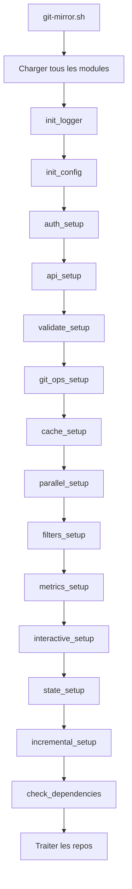

# Architecture du Projet Git-Mirror

**Version**: 2.5.0  
**Date**: 2025-01-28  
**Pattern**: Facade + Command + Observer + Module

---

## Table des Matières

- [Vue d'Ensemble](#vue-densemble)
- [Architecture Modulaire](#architecture-modulaire)
- [Design Patterns](#design-patterns)
- [Modules Détail](#modules-détail)
- [Flux d'Exécution](#flux-dexécution)
- [Configuration](#configuration)
- [Gestion des Erreurs](#gestion-des-erreurs)
- [Tests et Validation](#tests-et-validation)
- [Roadmap Technique](#roadmap-technique)

---

## Vue d'Ensemble

Git-Mirror est un script Bash avancé pour le clonage et la synchronisation de dépôts GitHub. Il utilise une **architecture modulaire** avec 13 modules spécialisés orchestrés par un script principal.

### Philosophie de Conception

- **Modularité**: Chaque module gère un domaine fonctionnel spécifique
- **Séparation des Préoccupations**: Responsabilité unique par module
- **Configuration Externalisée**: Personnalisation sans modification du code
- **Gestion d'Erreurs Robuste**: Trapping, validation, logging
- **Testabilité**: Modules isolés et testables individuellement

---

## Architecture Modulaire

### Vue d'Ensemble de la Structure

```
git-mirror/
├── git-mirror.sh          # ⭐ FACADE - Orchestration
├── config/                # ⚙️ Configuration externalisée
│   ├── config.sh          # Config principale (330 lignes)
│   └── *.conf             # 12 fichiers de config spécialisés
├── lib/                   # 📦 13 Modules fonctionnels
│   ├── api/              # API GitHub (480 lignes)
│   ├── auth/             # Authentification (365 lignes)
│   ├── cache/            # Cache API (332 lignes)
│   ├── filters/          # Filtrage (358 lignes)
│   ├── git/              # Opérations Git (453 lignes)
│   ├── incremental/      # Mode incrémental (204 lignes)
│   ├── interactive/      # Interface interactive (335 lignes)
│   ├── logging/          # Système de logs (206 lignes)
│   ├── metrics/          # Métriques (275 lignes)
│   ├── parallel/         # Parallélisation (229 lignes)
│   ├──一致的/logging.sh   - 206 lignes
│   ├── state/            # Gestion d'état (267 lignes)
│   ├── utils/            # Utilitaires (100 lignes)
│   └── validation/       # Validation (369 lignes)
└── tests/                # 🧪 Infrastructure de tests
    ├── spec/             # Tests ShellSpec (BDD)
    ├── integration/      # Tests d'intégration
    ├── regression/       # Tests de régression
    ├── load/            # Tests de charge
    └── mocks/           # Données mockées
```

---

## Design Patterns

### 1. Facade Pattern

**Implémentation**: `git-mirror.sh`

Le script principal agit comme une **façade** qui orchestre les modules sans exposer leur complexité interne.

```bash
# Chargement de tous les modules
source "$LIB_DIR/logging/logger.sh"
source "$CONFIG_DIR/config.sh"
source "$LIB_DIR/auth/auth.sh"
# ... (13 modules au total)

# Orchestration dans main()
init_logger ...
init_config ...
auth_setup ...
api_setup ...
validate_setup ...
# ... (initialisation séquentielle)
```

**Avantages**:
- Interface unique et simple
- Découplage des modules
- Maintenance facilitée

---

### 2. Command Pattern

**Implémentation**: Fonctions `*_setup()` de chaque module

Chaque module expose une fonction d'initialisation standardisée :

```bash
# Pattern standard pour chaque module
module_name_setup() {
    local result=0
    # Validation
    # Initialisation
    # Configuration
    return $result
}
```

**Exemples**:
- `auth_setup()` - Initialise l'authentification
- `api_setup()` - Initialise l'API GitHub
- `validate_setup()` - Initialise la validation
- `git_ops_setup()` - Initialise les opérations Git
- `cache_setup()` - Initialise le cache
- `parallel_setup()` - Initialise la parallélisation
- `filters_setup()` - Initialise le filtrage
- `metrics_setup()` - Initialise les métriques
- `interactive_setup()` - Initialise l'interface interactive
- `state_setup()` - Initialise la gestion d'état
- `incremental_setup()` - Initialise le mode incrémental

---

### 3. Module Pattern

**Implémentation**: Organisation en dossiers `lib/`

Chaque module est **auto-contenu** dans son propre dossier :

```
lib/api/
├── github_api.sh         # Code du module
└── (fonctions exportées)  # Interface publique
```

**Caractéristiques**:
- Un fichier par module
- Fonctions préfixées par le nom du module
- Interface publique définie
- Documentation interne

---

### 4. Observer Pattern

**Implémentation**: Système de logging et métriques

Les modules écrivent leurs événements via le système de logging, observé et agrégé :

```bash
# Dans les modules
log_info "Traitement démarré"
log_error "Échec détecté"
log_debug "Détail technique"

# Agrégation dans le script principal
export_metrics "$METRICS_FILE" "json"
```

---

## Modules Détail

### 1. 🪵 Module Logging (`lib/logging/logger.sh`)

**Responsabilité**: Gestion unifiée des logs

**Fonctions Principales**:
- `init_logger(verbose, quiet, dry_run)` - Initialisation
- `log_info(message)` - Log d'information
- `log_error(message)` - Log d'erreur
- `log_warning(message)` - Log d'avertissement
- `log_debug(message)` - Log de debug
- `log_success(message)` - Log de succès
- `log_dry_run(message)` - Log mode simulation

**Niveaux de Verbosité**:
- `QUIET`: Aucun output (erreurs fatales uniquement)
- `NORMAL`: Informations essentielles
- `VERBOSE (-v)`: Détails supplémentaires
- `DEBUG (-vv)`: Mode debug détaillé
- `TRACE (-vvv)`: Trace complète

---

### 2. 🔐 Module Auth (`lib/auth/auth.sh`)

**Responsabilité**: Authentification multi-méthodes

**Méthodes Supportées**:
1. **Token GitHub**: Variable `GITHUB_TOKEN`
2. **Clé SSH**: Variable `GITHUB_SSH_KEY`
3. **Authentification Publique**: Par défaut

**Fonctions Principales**:
- `auth_setup()` - Initialise l'authentification
- `get_auth_header()` - Retourne le header d'auth
- `detect_auth_method()` - Détecte la méthode disponible
- `validate_token()` - Valide le token
- `validate_ssh_key()` - Valide la clé SSH

**Variables d'Environnement**:
```bash
GITHUB_TOKEN="ghp_xxxxx"           # Token GitHub
GITHUB_SSH_KEY="/path/to/id_rsa"  # Clé SSH
GITHUB_AUTH_METHOD="token|ssh|public"  # Forcer méthode
```

---

### 3. 🌐 Module API (`lib/api/github_api.sh`)

**Responsabilité**: Interactions avec l'API GitHub

**Fonctionnalités**:
- Gestion des rate limits
- Pagination automatique
- Cache des requêtes
- Gestion des erreurs HTTP

**Fonctions Principales**:
- `api_setup()` - Initialise l'API
- `fetch_repos(context, username)` - Récupère la liste des repos
- `get_repo_count(context, username)` - Compte les repos
- `api_get_stats()` - Statistiques API
- `handle_rate_limit()` - Gestion des limites

**Endpoints Utilisés**:
- `GET /users/{username}/repos` - Repos d'un utilisateur
- `GET /orgs/{org}/repos` - Repos d'une organisation
- `GET /user` - Informations utilisateur authentifié
- `GET /rate_limit` - Limites de rate

---

### 4. ✅ Module Validation (`lib/validation/validation.sh`)

**Responsabilité**: Validation des paramètres et prérequis

**Fonctions Principales**:
- `validate_setup()` - Initialise la validation
- `validate_all_params(...)` - Valide tous les paramètres
- `validate_context(context)` - Valide le contexte (users/orgs)
- `validate_username(name)` - Valide un nom d'utilisateur
- `validate_directory(path)` - Valide un chemin
- `check_dependencies()` - Vérifie les dépendances

**Validations**:
- ✅ Contexte doit être `users` ou `orgs`
- ✅ Username conforme aux patterns GitHub
- ✅ Répertoire accessible en écriture
- ✅ Dépendances installées (git, jq, curl)
- ✅ Version minimale des dépendances

---

### 5. 🔧 Module Git Ops (`lib/git/git_ops.sh`)

**Responsabilité**: Opérations Git (clone, pull, etc.)

**Fonctions Principales**:
- `git_ops_setup()` - Initialise Git
- `clone_repo(url, dest, options)` - Clone un dépôt
- `update_repo(path)` - Met à jour un dépôt existant
- `repository_exists(path)` - Vérifie l'existence
- `get_current_branch(path)` - Récupère la branche actuelle
- `get_git_stats()` - Statistiques Git

**Options Supportées**:
- `--filter blob:none` - Clone partiel
- `--no-checkout` - Sans checkout
- `--single-branch` - Une seule branche
- `--depth N` - Clone shallow
- `--timeout SECONDS` - Timeout

---

### 6. 💾 Module Cache (`lib/cache/cache.sh`)

**Responsabilité**: Cache des réponses API

**Fonctionnalités**:
- Cache sur disque (JSON)
- Expiration configurable
- Invalidation sur demande
- Statistiques du cache

**Fonctions Principales**:
- `cache_setup()` - Initialise le cache
- `cache_get(key)` - Récupère du cache
- `cache_set(key, value, ttl)` - Stocke dans le cache
- `cache_invalidate(key)` - Invalide le cache
- `get_cache_stats()` d'utilisation

**Répertoire de Cache**:
```
.git-mirror-cache/
├── api-responses/        # Réponses API
├── repo-lists/          # Listes de dépôts
└── metadata/            # Métadonnées
```

---

### 7. 🔀 Module Parallel (`lib/parallel/parallel.sh`)

**Responsabilité**: Parallélisation avec GNU parallel

**Fonctionnalités**:
- Traitement parallèle des repos
- Contrôle du nombre de jobs
- Gestion des jobs interrompus
- Statistiques de performance

**Fonctions Principales**:
- `parallel_setup()` - Initialise la parallélisation
- `process_parallel(repos, jobs)` - Traite en parallèle
- `run_in_parallel(command)` - Exécute une commande en parallèle
- `parallel_cleanup()` - Nettoyage
- `get_parallel_stats()` - Statistiques

**Dépendance**: GNU parallel (optionnel)

---

### 8. 🎯 Module Filters (`lib/filters/filters.sh`)

**Responsabilité**: Filtrage des dépôts

**Types de Filtres**:
1. **Exclusion par Pattern**: `--exclude "test-*"`
2. **Inclusion par Pattern**: `--include "project-*"`
3. **Exclusion de Forks**: `--exclude-forks`
4. **Filtrage par Type**: `--repo-type public|private|all`
5. **Fichiers de Patterns**: `--exclude-file patterns.txt`

**Fonctions Principales**:
- `filters_setup()` - Initialise le filtrage
- `should_exclude_repo(repo_name)` - Teste l'exclusion
- `should_include_repo(repo_name)` - Teste l'inclusion
- `filter_repos(repos)` - Filtre la liste
- `get_filter_stats()` - Statistiques

---

### 9. 📊 Module Metrics (`lib/metrics/metrics.sh`)

**Responsabilité**: Collecte et export des métriques

**Métriques Collectées**:
- Nombre de repos clonés/mis à jour/échoués
- Temps d'exécution
- Taille des dépôts
- Statistiques de succès/échec

**Fonctions Principales**:
- `metrics_setup()` - Initialise les métriques
- `metrics_record_repo(name, action, time)` - Enregistre
- `metrics_calculate()` - Calcule les agrégats
- `export_metrics(file, format)` - Exporte les métriques

**Formats d'Export**:
- JSON
- CSV
- HTML

---

### 10. 💬 Module Interactive (`lib/interactive/interactive.sh`)

**Responsabilité**: Interface utilisateur interactive

**Fonctionnalités**:
- Confirmations interactives
- Affichage de résumé
- Gestion des interruptions
- Messages de progression

**Fonctions Principales**:
- `interactive_setup()` - Initialise l'interface
- `confirm_action(message)` - Demande confirmation
 elegant messages(message)` - Affiche des messages
- `get_interactive_stats()` - Statistiques

**Modes**:
- `--interactive` - Mode interactif
- `--confirm` - Afficher résumé + confirmation
- `--yes` - Mode automatique (sans confirmation)

---

### 11. 📁 Module State (`lib/state/state.sh`)

**Responsabilité**: Gestion de l'état d'exécution

**Fonctionnalités**:
- Sauvegarde de l'état
- Reprise d'exécution (`--resume`)
- Tracking de progression
- Protection contre les interruptions

**Fonctions Principales**:
- `state_setup()` - Initialise la gestion d'état
- `save_state(data)` - Sauvegarde l'état
- `restore_state()` - Restaure l'état
- `clear_state()` - Nettoie l'état
- `get_state()` - Récupère l'état

**Fichier d'État**:
```
.git-mirror-state.json
{
  "last_repo": "...",
  "completed": [...],
  "failed": [...],
  "timestamp": "..."
}
```

---

### 12. 📈 Module Incremental (`lib/incremental/incremental.sh`)

**Responsabilité**: Mode incrémental (seulement repos modifiés)

**Fonctionnalités**:
- Comparaison de timestamps
- Cache des derniers états
- Détection de modifications
- Optimisation du temps d'exécution

**Fonctions Principales**:
- `incremental_setup()` - Initialise le mode incrémental
- `is_repo_modified(repo, timestamp)` - Vérifie si modifié
- `get_last_sync_timestamp()` - Récupère le dernier sync
- `update_sync_timestamp()` - Met à jour le timestamp

**Option**: `--incremental`

---

### 13. 🛠️ Module Utils (`lib/utils/profiling.sh`)

**Responsabilité**: Profiling et utilitaires

**Fonctionnalités**:
- Mesure du temps d'exécution
- Profiling des fonctions
- Statistiques de performance
- Rapport de profiling

**Fonctions Principales**:
- `profiling_enable()` - Active le profiling
- `profiling_start(function)` - Démarre le profiling
- `profiling_stop(function)` - Arrête le profiling
- `profiling_summary()` - Affiche le résumé

**Option**: `--profile`

---

## Flux d'Exécution

### Séquence d'Initialisation



### Flux de Traitement d'un Repo

```
1. Récupérer la liste des repos via API
2. Appliquer les filtres (exclude/include)
3. Mode incrémental : Vérifier si modifié
4. Mode parallèle : Distribuer les jobs
5. Pour chaque repo :
   a. Vérifier si existe déjà
   b. Clone (si nouveau) ou Pull (si existant)
   c. Enregistrer les métriques
   d. Gérer les erreurs
6. Exporter les métriques finales
7. Afficher le résumé
```

---

## Configuration

### Structure de Configuration

```
config/
├── config.sh              # Config principale (logique)
├── git-mirror.conf        # Config par défaut
├── performance.conf       # Performances
├── security.conf          # Sécurité
├── cicd.conf             # CI/CD
├── ci.conf               # Intégration continue
├── deployment.conf       # Déploiement
├── testing.conf          # Tests
├── maintenance.conf      # Maintenance
├── dependencies.conf     # Dépendances
└── documentation.conf    # Documentation
```

### Chargement de la Configuration

1. **config.sh** - Chargé en premier, définit les variables
2. **Fichiers .conf** - Chargés selon le contexte
3. **Arguments CLI** - Override la configuration
4. **Variables d'environnement** - Override finale

---

## Gestion des Erreurs

### Stratégie de Gestion

1. **Sécurité Bash**: `set -euo pipefail`
2. **Trapping des Signaux**: SIGINT, SIGTERM
3. **Validation Proactive**: Vérifier avant d'agir
4. **Logging Complet**: Tous les événements logués
5. **Mode Dry-Run**: Simulation sans effet

### Niveaux d'Erreur

- **INFO**: Informations normales
- **WARNING**: Avertissement (continue)
- **ERROR**: Erreur récupérable
- **FATAL**: Erreur fatale (arrêt)

---

## Tests et Validation

### Infrastructure de Tests

```
tests/
├── spec/                  # Tests ShellSpec (BDD)
│   ├── unit/             # Tests unitaires par module
│   └── integration/      # Tests d-de-end
├── integration/          # Tests d'intégration
├── regression/           # Tests de régression
├── load/                # Tests de charge
└── mocks/               # Données mockées
```

### Couverture par Module

| Module | Tests | Status |
|--------|-------|--------|
| logging | ✅ | Complet |
| auth | ✅ | Complet |
| validation | ✅ | Complet |
| api | ✅ | Critique |
| git_ops | ✅ | Complet |
| cache | ✅ | Complet |
| filters | ✅ | Complet |
| metrics | ✅ | Complet |
| parallel | ✅ | Complet |
| state | ✅ | Complet |
| incremental | ✅ | Complet |
| interactive | ⚠️ | Partiel |
| profiling | ⚠️ | Partiel |

---

## Roadmap Technique

### Améliorations Futures

1. **Tests Manquants**:
   - [ ] Tests pour `interactive.sh`
   - [ ] Tests pour `profiling.sh`

2. **Coverage**:
   - [ ] Activer kcov pour métriques précises
   - [ ] Objectif: 90%+ coverage

3. **Performance**:
   - [ ] Benchmarking détaillé
   - [ ] Optimisation des appels API

4. **Documentation**:
   - [x] ARCHITECTURE.md (créé)
   - [ ] Guide de développement
   - [ ] Contribution guidelines avancées

---

**Document créé**: 2025-01-28  
**Auteur**: Architecture Team  
**Version**: 1.0.0

